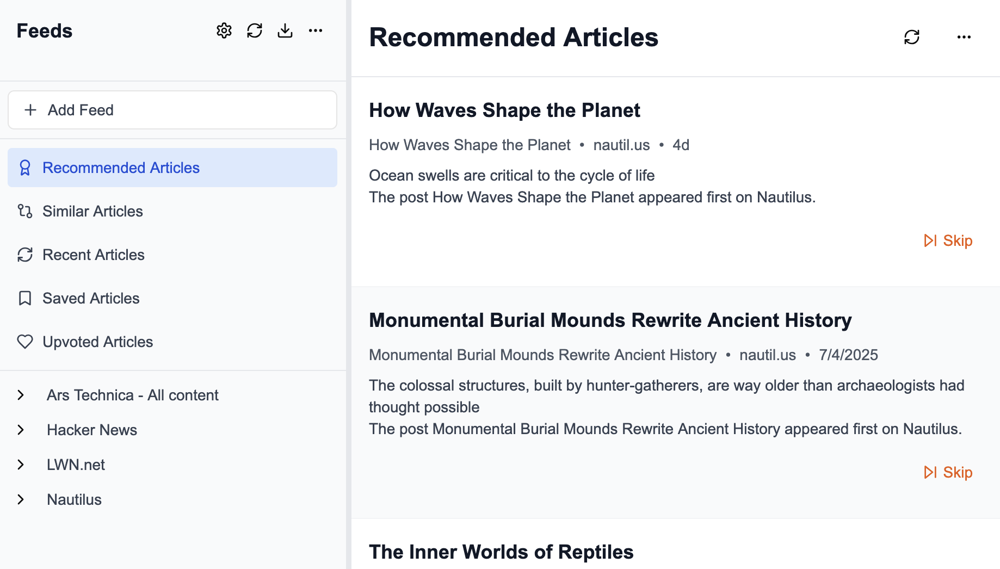
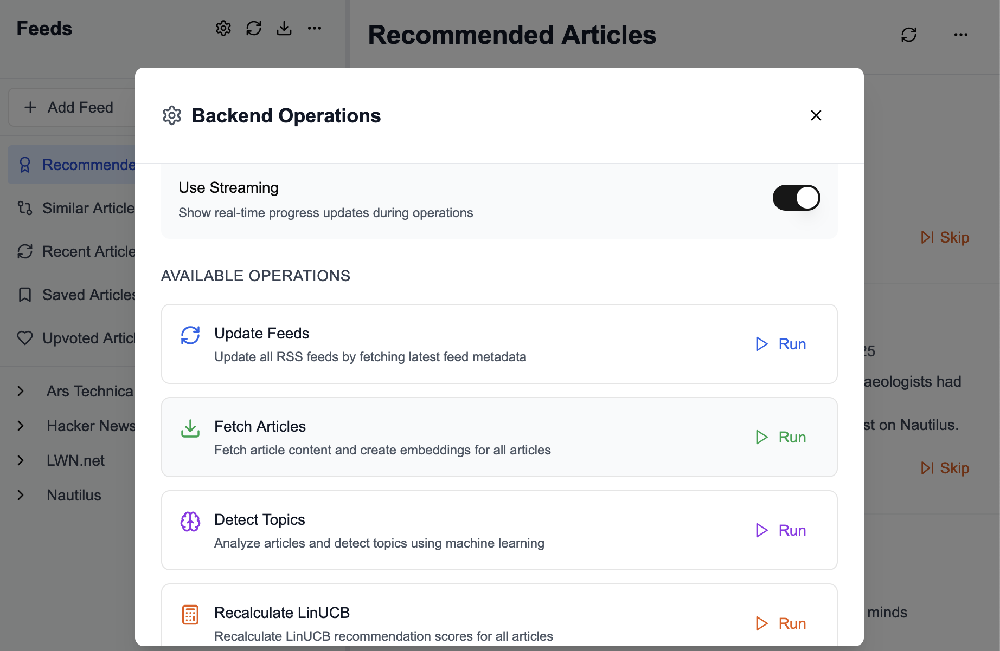

# HabitFeed

[](https://opensource.org/licenses/AGPL-3.0)
[](https://www.python.org/downloads/)
[](https://nextjs.org/)

This is a local RSS reader that tries to use modern recommendation techniques, only instead of some company trying to get you to click on stuff that benefits them, its recommendations are driven by *you* and your personal habits you want to encourage in yourself.

Ideally, you can subscribe to a bunch of RSS feeds, get a lot of articles, and with some feedback, you'll get a personalized feed of articles you find the most interesting bubbled to the top.

## Features

- 📰 **RSS Feed Management**: Subscribe to multiple RSS feeds
- 🤖 **AI-Powered Recommendations**: Uses modern recommendation algorithms
- 🔒 **Privacy-First**: Runs locally, your data stays yours
- 📊 **Smart Scoring**: Multi-layer recommendation system with embeddings and LinUCB
- 🎯 **Personalized Feed**: Articles ranked based on your preferences
- 🔍 **Topic Detection**: Automatic topic categorization
- 💾 **Local Storage**: SQLite database for data persistence

## Screenshots




## Why this way?

In this day and age there are enough opaque filtering algorithms out there - one might even argue many social problems come from opaque algorithms that blindly reward any attention, positive or negative.

We are our habits, though. So if we keep clicking on and reading clickbait or articles we wish we hadn't, we'll find ourselves feeling those residual feelings those articles create. Our whole mood and undercurrent of world views will continue to be formed by those feelings designed to make us click above all else.

This is an attempt to take that back. Use the same kinds of algorithms and recommendation systems, except feed it with explicit signals of interactions that we want to have and have it train and reward accordingly.

### In practice

This is intended to be run locally and single-user, so your preferences are your own (they aren't being exploited by a company learning how to get you to click against your will)

This is also licensed under the AGPL, so anyone running a hosted version will also need to make the recommendation system's source code inspectable and available for others to see and understand.

## Quick Start

### Prerequisites

- Python 3.8+
- Node.js 16+
- npm or pnpm

### Installation

1. **Clone the repository**
   ```bash
   git clone <repository-url>
   cd personal_rss
   ```

2. **Install Python dependencies**
   ```bash
   pip install -r requirements.txt
   ```

3. **Initialize the database**
   ```bash
   ./service_cmd.py create-db
   ```
   This will create a `rss.db` file in the `data/` directory.

4. **Install frontend dependencies**
   ```bash
   cd frontend
   npm install --legacy-peer-deps
   ```

### Running the Application

#### Backend API
From the main directory (default port 8000):
```bash
uvicorn api.main:app --reload
```

#### Frontend
From the `frontend` directory (default port 3000):
```bash
npm run build
npm run start
```

### Adding RSS Feeds
You can add RSS feeds directly from the frontend interface.

## Recommendation Pipeline

Once a feed is added, there are several steps before you can get recommendations. These steps can be run from `./service_cmd` or from the frontend.

### Step-by-Step Process

#### 1. `update-feeds`
Fetch each feed and look for new entries. If there's a new entry, create a skeleton 'article' object for each one. They don't have titles yet but they do have summaries.

#### 2. `fetch-articles`
Fetch the full text of the articles along with other details from the article URLs.

> **⚠️ Note**: This is also why this should be hosted locally. There are ethical and legal complications to scraping another site and hosting the content.

This step also generates embeddings for the articles.

#### 3. `detect-topics`
Detect all the topics of the given article.

#### 4. Interact with Articles
*This isn't a command* - This is the right time to interact with articles and give positive or negative feedback to build up training data.

#### 5. `update-profile-embeddings`
Explicitly use the feedback data to create positive and negative sentence-vector summaries of things the user liked and didn't. This is done automatically as well on every interaction.

#### 6. `calculate-embedding-scores`
Calculate scores for each article (going back a given number of days) based entirely on similarity to articles the user likes or dislikes. This shows up in the UI as "similar articles".

#### 7. `recalculate-linucb-scores`
The 'final layer' of recommendation. Takes everything, including similarity scores, topics, feed preferences, etc., and generates a 'final recommendation score' for each article.

### Process Notes

It's wasteful to recalculate embedding scores and LinUCB scores for every article after every single interaction, so we don't. Right now this needs to be run manually.

## Testing

Run tests using pytest:
```bash
pytest tests/
```

## Contributing

This project is licensed under AGPL-3.0. Contributions are welcome! Please feel free to submit a Pull Request.

## About

Built by Nimish Gåtam. Programmer, AI and tech enthusiast.

While I love open-source, I've noticed there are very few open-source projects that embrace recommendation algorithms, meaning this technology and infrastructure stays in the corporate realm.

We live in a deluge of information, sifting through it may be noble but it's not realistic for everyone and it's not a character flaw to use technology to curate your information diet.

I hope that, rather than shunning recommendation algorithms, this will be the first step to open-source projects embracing them and allowing people to take control of their own habits and set up their own positive patterns.